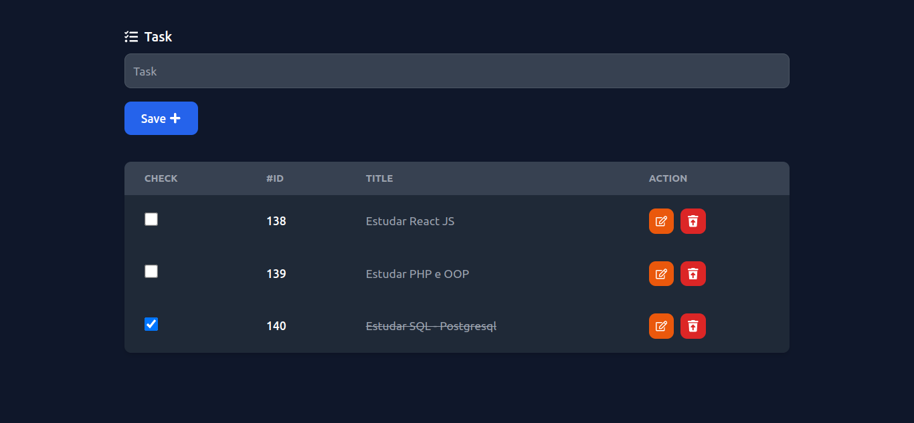

<h1 align="center">
  <br />
  
  <br />
  Todo List
  <br />
</h1>

<h4 align="center">
  Aplicação Full Stack desenvolvida com PHP, PostgreSQL, ReactJS e Docker.
</h4> 

<p align="center">
  
  
  
</p>



### Description💡
Aplicação <b>Full Stack</b> que consiste em <b>ler</b>, <b>criar</b>, <b>editar</b> e <b>deletar</b> livros pessoais, assim também como <b>modificar</b> dados do usuário.

A <b>API</b> foi desenvolvida com <b>PHP</b>, fazendo somente a utilização de uma biblioteca externa para variáveis de ambiente. Quanto ao restante, utiliza-se recursos do próprio <b>PHP</b>, como a <b>library GD</b> para redimensionar as images, <b>Rotas</b>, <b>URL amigável</b>, <b>JWT</b>, <b>Injenção de Dependência</b>, <b>PostgreSQL</b> com <b>PDO</b> Transactions SQL e muito mais.

No <b>frontend</b> foi utilizado o <b>ReactJS</b> para componentizar a aplicação, trazendo também diversos recursos interessantes como <b>useState</b>, <b>useContext</b>, <b>React Router</b>, UI com <b>Chakra UI</b>, <b>Vite</b> e entre outros.

Para organizar o projeto, fora usado o <b>Docker</b>, que traz muitos recursos valiosos para a execução de toda a aplicação.

### Features 💿

* <b>API</b>
  - PHP - v8.1
   - Composer | psr-4
   - Routes
   - Dependency Injection
   - env (vlucas/phpdotenv) - v5.5
   - JWT Auth
   - GD - Resize Image
   - PDO | PDO Pgsql 
   - Upload Image
   - Cors
* <b>Database</b>
  - PostgreSQL
     - BLOB (Binary Large Object)
     - Transactions
* <b>Web</b>:
    - ReactJS - Latest
      - Vite
      - pnpm
      - UI - Chakra UI | react / icons
      - Axios
      - React Router
      - Local Storage
* <b>Devops</b>:
  - Docker

### How to use 💻

Para executar a aplicação serão necessários alguns passos importantes.


```sh

# Clone Repository
$ git clone https://github.com/EricNeves/myBooksApplication.git

# MyBooksAplication Folder
$ cd myBooksApplication/

# Install Dependencies - ReactJS
$ cd web && pnpm install

# Install Dependencies - PHP
$ cd www && composer update

# Execute Docker Commands
$ docker-compose -f www/docker-compose.yml up -d --build && docker-compose -f web/docker-compose.yml up -d --build

```

### Application Process ⚙️

* <b>API</b>
  - localhost:8181
* <b>Adminer</b>
  - localhost:8282
* <b>Web</b>
  - localhost:3131

O proximo passo será copiar as informações que estão dentro do arquivo <b>database.sql</b> que se encontra na raiz do projeto e posteriormente acessar o Adminer (<b>localhost:8282</b>). 

Obs: password: <b>root</b>


Após isso procure por <b>SQL command</b> e execute as informações copiadas do arquivo <b>database.sql</b>.

Depois de todo o processo, acesse <b>localhost:3131</b> para consumir toda a aplicação.

### License 📃


### Author 🧑‍💻
<a href="https://www.instagram.com/ericneves_dev/"></a> <a href="https://linkedin.com/in/ericnevesrr"> </a>
