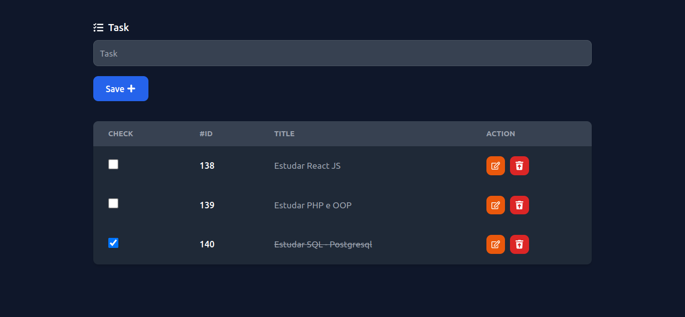
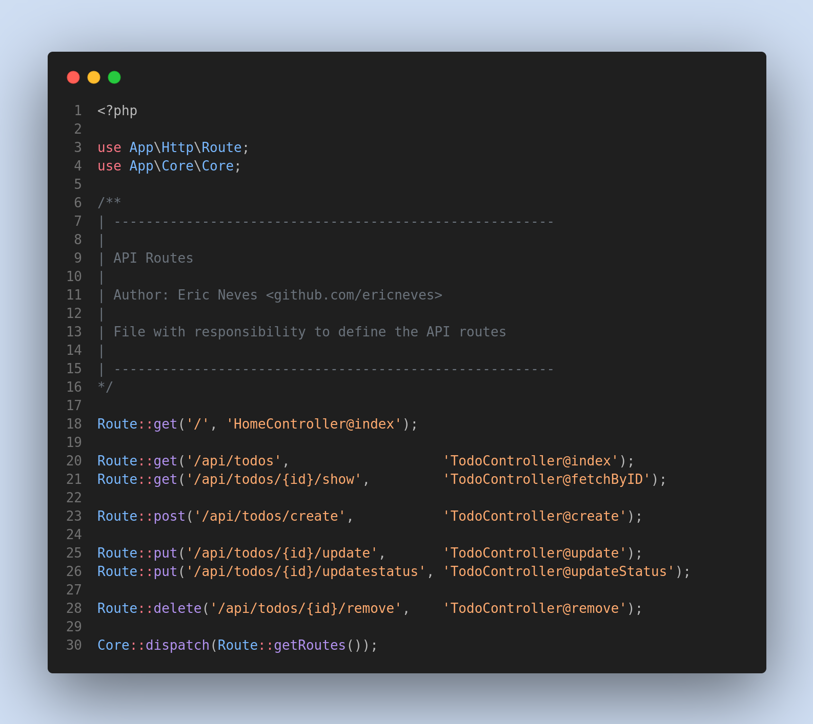

<h1 align="center">
  <br />
  
  <br />
  Todo List
  <br />
</h1>

<h4 align="center">
  Aplicação Full Stack desenvolvida com PHP, PostgreSQL, ReactJS, Tailwind CSS e Docker.
</h4> 

<p align="center">
  
  
  
</p>




### Description

**Todo** **List**, um app desenvolvido com **PHP**, **Postgresql**, **ReactJS**, **Tailwind** **CSS**, **Docker** e entre outras tecnologias. A aplicação consiste em gerenciar uma lista afazeres, com funcionalidades para **criar**, **editar** ou **deletar** **tasks**.

A API foi desenvolvida com **PHP**, **Postgresql**, **PDO**, **OOP**, **Injenção** **de** **Dependência** e entre outros recursos, também como, mudança no sistema de rotas, trazendo melhorias na hora determinar os métodos **HTTP**, garantindo mais segurança no uso dos **endpoints**.

Essa aplicação tem como foco principal **enaltecer** as melhorias no **backend**.

No frontend foi utilizado o **ReactJS** para componentizar a aplicação, trazendo também diversos recursos como **ciclo** **de** **vida** dos componentes, juntamente com o uso do **Tailwind** **CSS** como elemento visual.

Para organizar o projeto, foi usado o **Docker**, que traz muitos recursos valiosos como, **segregação** **de** **redes**, **organização** **de** **todo** **o** **app** e **flexibilidade**.

### Features 

* <b>API</b>
  - PHP - v8.1
   - Composer | psr-4
   - Routes
   - Dependency Injection
   - env (vlucas/phpdotenv) - v5.5
   - PDO | PDO Pgsql 
   - Cors
* <b>Database</b>
  - PostgreSQL
* <b>Web</b>:
    - ReactJS - Latest
      - Vite
      - pnpm
      - UI - Tailwind CSS
      - Axios
* <b>Devops</b>:
  - Docker

### How to use 

Para executar a aplicação serão necessários alguns passos importantes.


```sh

# Clone Repository
$ git clone https://github.com/EricNeves/todoList

# todoList Folder
$ cd todoList/

# Install Dependencies - ReactJS
$ cd web && pnpm install

# Install Dependencies - PHP
$ cd www && composer update


```

Agora, na raiz do projeto (**./todoList**) execute o comando abaixo:

```sh

# Execute Docker Command
$ docker-compose -f -d --build

```

### Application Process 

* <b>API</b>
  - http://localhost:8000
* <b>Web</b>
  - http://localhost:3000


### License 


### Author 🧑‍💻
<a href="https://www.instagram.com/ericneves_dev/"></a> <a href="https://linkedin.com/in/ericnevesrr"> </a>
